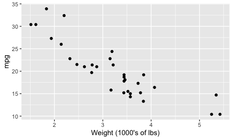
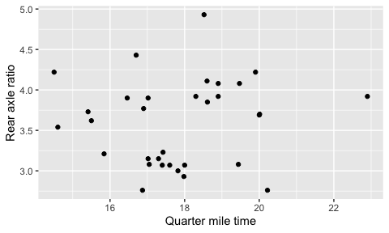
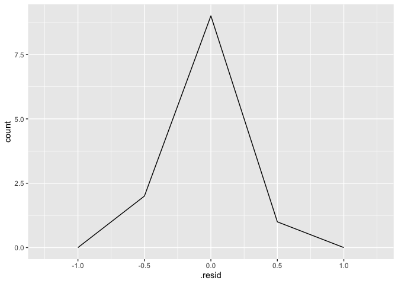
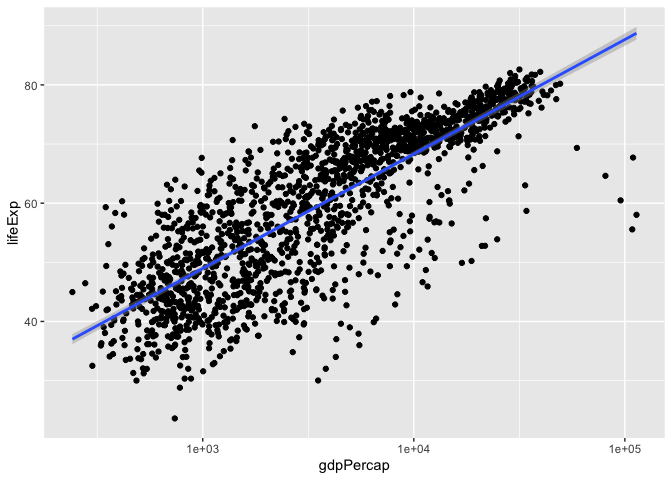
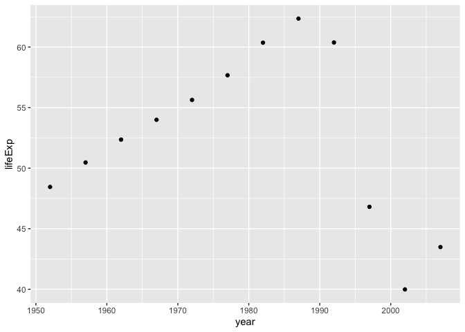
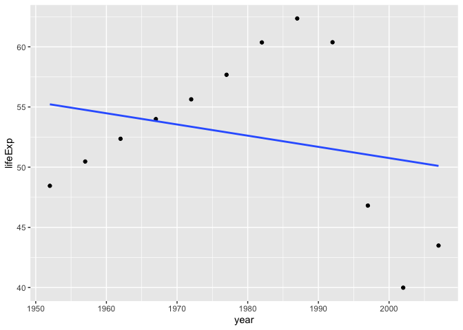
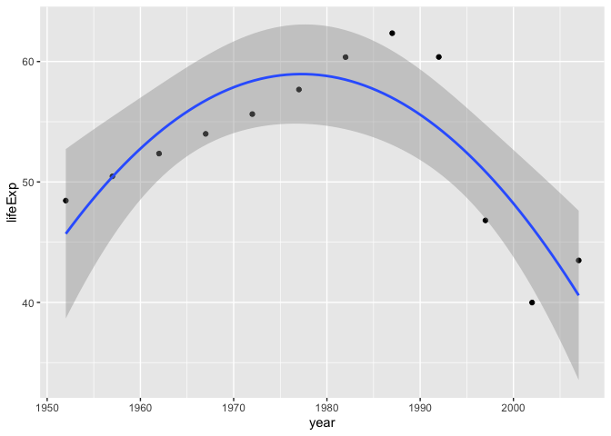

```r
suppressPackageStartupMessages(library(tidyverse))
library(gapminder)
library(broom)
```

So you want to fit a model to your data. How can you achieve this with R?

Topics:

1. What _is_ model-fitting?
2. How do we fit a model in R?
3. How can we obtain tidy results from the model output?

## What is Model-Fitting?

When variables are not independent, then we can gain information about one variable if we know something about the other.

Examples: Use the scatterplot below:

1. A car weighs 4000 lbs. What can we say about its mpg?
2. A car weights less than 3000 lbs. What can we say about its mpg?


```r
ggplot(mtcars, aes(wt, mpg)) +
  geom_point() +
  labs(x = "Weight (1000's of lbs)")
```

<!-- -->

Example: What can we say about rear axle ratio if we know something about quarter mile time?


```r
ggplot(mtcars, aes(qsec, drat)) + 
  geom_point() +
  labs(x = "Quarter mile time",
       y = "Rear axle ratio")
```

<!-- -->


If EDA isn't enough, we can answer these questions by fitting a model: a curve that predicts Y given X. Aka, a __regression curve__ or a __machine learning model__. 

(There are more comprehensive models too, such as modelling entire distributions, but that's not what we're doing here)

There are typically two goals of fitting a model:

1. Make predictions.
2. Interpret variable relationships.

## Fitting a model in R

Model fitting methods tend to use a common format in R:

```
method(formula, data, options)
```

They also tend to have a common output: a special _list_. 

__Method__:

A function such as:

- Linear Regression: `lm`
- Generalized Linear Regression: `glm`
- Local regression: `loess`
- Quantile regression: `quantreg::rq`
- ...

__Formula__:

In R, takes the form `y ~ x1 + x2 + ... + xp` (use column names in your data frame).

__Data__: The data frame.

__Options__: Specific to the method.

Exercise:

1. Fit a linear regression model to life expectancy ("Y") from year ("X") by filling in the formula. Notice what appears as the output.
2. On a new line, use the `unclass` function to uncover the object's true nature: a list. Note: it might be easier to use the `names` function to see what components are included in the list. 

First, create a subset of the `gapminder` dataset containing only the country of `France

```r
gapminder_France <- gapminder %>% 
  filter(country == "France")
```

Now, using the `lm()` function we will create the linear model

```r
(my_lm <- lm(lifeExp ~ year, data = gapminder_France))
```

```
## 
## Call:
## lm(formula = lifeExp ~ year, data = gapminder_France)
## 
## Coefficients:
## (Intercept)         year  
##   -397.7646       0.2385
```
Does that mean that the life expectency at "year 0" was equal to -397.7646?!
We are interested in the modeling results around the modeling period which starts at year 1952. To get a meaniningful "interpretable" intercept we can use the `I()` function.

```r
(my_lm <- lm(lifeExp ~ I(year-1952), data = gapminder_France))
```

```
## 
## Call:
## lm(formula = lifeExp ~ I(year - 1952), data = gapminder_France)
## 
## Coefficients:
##    (Intercept)  I(year - 1952)  
##        67.7901          0.2385
```

Use the `unclass()` function to take a look at how the `lm()` object actually looks like.

```r
(unclass(my_lm))
```

```
## $coefficients
##    (Intercept) I(year - 1952) 
##     67.7901282      0.2385014 
## 
## $residuals
##           1           2           3           4           5           6 
## -0.38012821 -0.05263520  0.33485781  0.18235082 -0.18015618  0.07733683 
##           7           8           9          10          11          12 
## -0.05517016  0.20232284  0.12981585  0.11730886 -0.12519814 -0.25070513 
## 
## $effects
##    (Intercept) I(year - 1952)                                              
##  -257.55220231    14.26030956     0.41516662     0.26479522    -0.09557618 
##                                                                            
##     0.16405242     0.03368103     0.29330963     0.22293823     0.21256684 
##                               
##    -0.02780456    -0.15117596 
## 
## $rank
## [1] 2
## 
## $fitted.values
##        1        2        3        4        5        6        7        8 
## 67.79013 68.98264 70.17514 71.36765 72.56016 73.75266 74.94517 76.13768 
##        9       10       11       12 
## 77.33018 78.52269 79.71520 80.90771 
## 
## $assign
## [1] 0 1
## 
## $qr
## $qr
##    (Intercept) I(year - 1952)
## 1   -3.4641016   -95.26279442
## 2    0.2886751    59.79130372
## 3    0.2886751     0.18965544
## 4    0.2886751     0.10603124
## 5    0.2886751     0.02240704
## 6    0.2886751    -0.06121716
## 7    0.2886751    -0.14484136
## 8    0.2886751    -0.22846557
## 9    0.2886751    -0.31208977
## 10   0.2886751    -0.39571397
## 11   0.2886751    -0.47933817
## 12   0.2886751    -0.56296237
## attr(,"assign")
## [1] 0 1
## 
## $qraux
## [1] 1.288675 1.273280
## 
## $pivot
## [1] 1 2
## 
## $tol
## [1] 1e-07
## 
## $rank
## [1] 2
## 
## attr(,"class")
## [1] "qr"
## 
## $df.residual
## [1] 10
## 
## $xlevels
## named list()
## 
## $call
## lm(formula = lifeExp ~ I(year - 1952), data = gapminder_France)
## 
## $terms
## lifeExp ~ I(year - 1952)
## attr(,"variables")
## list(lifeExp, I(year - 1952))
## attr(,"factors")
##                I(year - 1952)
## lifeExp                     0
## I(year - 1952)              1
## attr(,"term.labels")
## [1] "I(year - 1952)"
## attr(,"order")
## [1] 1
## attr(,"intercept")
## [1] 1
## attr(,"response")
## [1] 1
## attr(,".Environment")
## <environment: R_GlobalEnv>
## attr(,"predvars")
## list(lifeExp, I(year - 1952))
## attr(,"dataClasses")
##        lifeExp I(year - 1952) 
##      "numeric"      "numeric" 
## 
## $model
##    lifeExp I(year - 1952)
## 1   67.410              0
## 2   68.930              5
## 3   70.510             10
## 4   71.550             15
## 5   72.380             20
## 6   73.830             25
## 7   74.890             30
## 8   76.340             35
## 9   77.460             40
## 10  78.640             45
## 11  79.590             50
## 12  80.657             55
```

To complicate things further, some info is stored in _another_ list after applying the `summary` function:


```r
summary(my_lm)
```

```
## 
## Call:
## lm(formula = lifeExp ~ I(year - 1952), data = gapminder_France)
## 
## Residuals:
##      Min       1Q   Median       3Q      Max 
## -0.38013 -0.13894  0.01235  0.14295  0.33486 
## 
## Coefficients:
##                Estimate Std. Error t value Pr(>|t|)    
## (Intercept)    67.79013    0.11949  567.33  < 2e-16 ***
## I(year - 1952)  0.23850    0.00368   64.81 1.86e-14 ***
## ---
## Signif. codes:  0 '***' 0.001 '**' 0.01 '*' 0.05 '.' 0.1 ' ' 1
## 
## Residual standard error: 0.22 on 10 degrees of freedom
## Multiple R-squared:  0.9976,	Adjusted R-squared:  0.9974 
## F-statistic:  4200 on 1 and 10 DF,  p-value: 1.863e-14
```

Graphing residuals of the model

```r
mylm_resid<- augment(my_lm)

ggplot(mylm_resid, aes(.resid))+
  geom_freqpoly(binwidth = 0.5)
```

<!-- -->


We can use the `predict()` function to make predictions from the model (default is to use fitting/training data). Here are the predictions:


```r
gapminder_France2 <- data.frame(year = seq(2000, 2005))

predict(my_lm, newdata = gapminder_France2) %>% 
  head()
```

```
##       1       2       3       4       5       6 
## 79.2382 79.4767 79.7152 79.9537 80.1922 80.4307
```

We can plot models (with one predictor/ X variable) using `ggplot2` through the `geom_smooth()` layer. Specifying `method="lm"` gives us the linear regression fit (but only visually!):


```r
ggplot(gapminder, aes(gdpPercap, lifeExp)) +
    geom_point() +
    geom_smooth(method="lm") +
    scale_x_log10()
```

<!-- -->
Lets consider another country "Zimbabwe", which has a unique behavior in the `lifeExp` and `year` relationship.

```r
gapminder_Zimbabwe <- gapminder %>% 
  filter(country == "Zimbabwe")
  
gapminder_Zimbabwe %>% 
  ggplot(aes(year, lifeExp)) + geom_point()
```

<!-- -->
Let's try fitting a linear model to this relationship

```r
ggplot(gapminder_Zimbabwe, aes(year,lifeExp)) + geom_point()+geom_smooth(method = "lm", se = F)
```

<!-- -->
Now we will try to fit a second degree polynomial and see what would that look like.

```r
ggplot(gapminder_Zimbabwe, aes(x=year, y=lifeExp)) + 
  geom_point()+
  geom_smooth(method = "lm", formula = y ~ poly(I(x-1952), degree = 2))
```

<!-- -->
